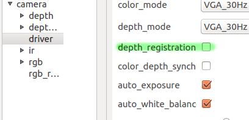
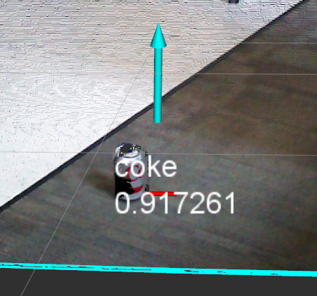

:orphan:

.. _getting_started:

================================================================================
Getting Started with ORK
================================================================================

--------------------------------------------------------------------------------
Introduction
--------------------------------------------------------------------------------

Welcome! This guide will help you get started with the Object Recognition Kitchen.
In this guide, you'll learn how to install and ORK packages to do a very simple
detection task: finding the pose of a can of soda on a flat surface.

ORK has several different detectors available. One of the simplest is called
``tabletop``, and it can be used to detect objects regardless of textures, as
long as you have a mesh of the object. This is the best detector for our
tutorial, since you can use any soda can you have nearby to test the detector.
After you're done with this tutorial, you can explore other detectors and
see if they work better for what you're trying to accomplish.

--------------------------------------------------------------------------------
Requirements
--------------------------------------------------------------------------------
Before starting, you should make sure that you have the following items:

- A computer with Ubuntu 16.04 and ROS Kinetic installed (``ros-kinetic-desktop-full``)
- A depth camera. This tutorial includes guides for two types of cameras:
  the Asus Xtion Pro/Pro Live and the Orbbec Astra.
  TODO insert pictures
- A can of soda (12 fl. oz./355 mL)--the object you'll be detecting.
  The color (brand) is not important, as long as the can is not mostly black
  (some depth cameras have a hard time detecting black objects).
- Flat area to perform detection. 0.5m x0.5m should be a large enough area.

--------------------------------------------------------------------------------
Step 1: Set up Workspace
--------------------------------------------------------------------------------

First, be sure to have your terminal set up to use ROS! You may have already
done this step as part of installation, but if you're not sure, it doesn't hurt
to do it again.

.. code-block:: sh

   source /opt/ros/kinetic/setup.sh # source your ros distribution

.. code-block:: sh

   cd ~                             # go to your home directory

   mkdir -p ork_ws/src              # create a new workspace folder
   cd ork_ws/src                    # enter the workspace folder
   catkin_init_workspace            # initialize the workspace

--------------------------------------------------------------------------------
Step 2: Install ORK
--------------------------------------------------------------------------------

First, install some required dependencies. You may already have some or all of
these packages on your system.

.. code-block:: sh

   sudo apt install git libopenni-dev ros-kinetic-catkin ros-kinetic-ecto* \
   ros-kinetic-opencv-candidate ros-kinetic-moveit-core ros-kinetic-rviz  \
   ros-kinetic-rqt-reconfigure

The easiest way to install ORK is via the ``apt`` packages, such as
``ros-kinetic-object-recognition-core``. Unfortunately, not all of the packages
are available via ``apt install``, especially for newer ROS distros (including
kinetic). So, we will build the packages we need from source, which is why we
set up a new catkin workspace in the previous step. Run the following commands
in the ``ork_ws/src`` directory (if you're following the tutorial, you're
already there):

.. code-block:: sh

   git clone http://github.com/wg-perception/object_recognition_core
   git clone http://github.com/wg-perception/tabletop
   git clone http://github.com/wg-perception/object_recognition_msgs
   git clone http://github.com/wg-perception/object_recognition_ros
   git clone http://github.com/wg-perception/object_recognition_ros_visualization
   git clone http://github.com/wg-perception/ork_tutorials

   cd ..                     # go to workspace root
   catkin_make               # build everything (this will take a few minutes)
   source devel/setup.bash   # add the new packages to your ROS package path

During this tutorial, you will be launching a lot of different terminals, and
many of them need to have ROS and/or ``ork_ws/devel/setup.bash`` sourced.
You will probably find it useful to add the ``source`` commands to your
``~/.bashrc`` file.

--------------------------------------------------------------------------------
Step 3: Install your camera
--------------------------------------------------------------------------------

Click the button below that corresponds to your camera type.

.. toggle_table::
   :arg1: Orbbec Astra
   :arg2: Asus Xtion

.. toggle:: Orbbec Astra

   .. code-block:: sh

      sudo apt install ros-kinetic-astra-camera ros-kinetic-astra-launch

   You also have to update your udev rules to allow access to the USB camera.
   Follow the guide at http://wiki.ros.org/astra_camera.

.. toggle:: Asus Xtion

   .. code-block:: sh

      sudo apt install ros-kinetic-openni2-camera ros-kinetic-openni2-launch

--------------------------------------------------------------------------------
Step 4: Install the CouchDB Backend
--------------------------------------------------------------------------------

ORK needs a way to store objects that it knows how to detect. When you train
the system, objects will be added to this knowledge base. The default way to
store objects is with a database system called CouchDB. The details of how
CouchDB works are not important; you just have to install it. From a terminal,
run:

.. code-block:: sh

   sudo apt install couchdb

You can check that the database is running as expected by running this command:

.. code-block:: sh

   curl -X GET http://localhost:5984
   # If CouchDB is working, you should get terminal output similar to the following:
   # {"couchdb":"Welcome","version":"1.0.1"}

--------------------------------------------------------------------------------
Step 5: Add an object to the database
--------------------------------------------------------------------------------

Congratulations, you are done with installation! Now you can add an object
to the CouchDB database for later detection. You'll be using a model of a soda
can, which is included in the ``ork_tutorials`` repository.

First, download the soda can model:

.. code-block:: sh

   wget https://github.com/wg-perception/ork_tutorials/raw/master/data/coke.stl

Then, add the model to the database (your terminal needs to have ROS and
your new ``ork_ws/devel/setup.bash`` sourced):

.. code-block:: sh

   rosrun object_recognition_core object_add.py -n "soda_can" -d "A can of soda"
   rosrun object_recognition_core mesh_add.py <the object id that previous command returned> coke.stl

--------------------------------------------------------------------------------
Step 6: Set up your ORK configuration file
--------------------------------------------------------------------------------

ORK uses configuration files, which usually have the extension ``.ork``, to
create *sources*, *sinks*, and *pipelines*. Roughly speaking, sources create
data, sinks accept data, and pipelines define how data flows from sources to sinks.

For this tutorial, you don't have to concern yourself with the details of ``.ork``
files. Instead, you can download pre-written ones that are already set up for your
camera.

The configuration file we'll use is located at
``ork_ws/src/ork_tutorials/conf/gettingstarted.ork``.

--------------------------------------------------------------------------------
Step 7: Run detection
--------------------------------------------------------------------------------

Click the button below that corresponds to your camera type.

.. toggle_table::
   :arg1: Orbbec Astra
   :arg2: Asus Xtion

First, launch the camera driver to generate depth clouds and publish them to
ROS topics. First, make sure your camera is plugged in. Then, from a terminal,
with ROS sourced, run

.. toggle:: Orbbec Astra

   .. code-block:: sh

      roslaunch astra_launch astra.launch

.. toggle:: Asus Xtion

   .. code-block:: sh

      roslaunch openni2_launch openni2.launch

Next, you need to enable *registration*. This will align the color and depth images
coming from the camera, which greatly increases recognition accuracy. To enable
registration, use the ``rqt_reconfigure`` program by running the following command
**in a new terminal** (do not close the terminal running the camera driver from above):

.. code-block:: sh

   rosrun rqt_reconfigure rqt_reconfigure

The ``rqt_reconfigure`` window should pop up. Using the panel on the left,
drill down to ``camera/driver``. In the right panel, check the box for
``depth_registration``. Once the box is checked, you can safely close rqt_reconfigure
(and the terminal you used to launch it).

         depth_registration checkbox
   :align: center

Now you can run the actual detector. In a terminal, with ROS and ``ork_ws`` sourced,
run

.. code-block:: sh

   rosrun object_recognition_core detection -c `rospack find object_recognition_tutorials`/conf/gettingstarted.ork

--------------------------------------------------------------------------------
Step 8: View detection results
--------------------------------------------------------------------------------

If all is going smoothly, you are now detecting objects using your camera! But,
you have no way to tell if it's actually working or not. You can view the output
on the terminal (ROS and ``ork_ws`` must be sourced) by running

``rostopic echo recognized_object_array``.

You can also use RViz to visualize what's happening.

 - Set your RViz Fixed Frame to ``camera_link``.
 - Use the Add button to add three Displays: a DepthCloud, an ORKTable, and an
   ORKObject

   .. image:: img/getting_started/ros_views.png
      :alt: Screenshot of the Add Display panel in RViz, showing the ORK
            Displays.
      :align: center

 - On the DepthCloud, set the Depth Map Topic to ``/camera/depth/image_rect``,
   and set the Color Image Topic to ``/camera/rgb/image_rect_color``. You should
   see the depth camera's colored points in the RViz window.

   .. image:: img/getting_started/depth_camera_topics.png
      :alt: Screenshot of the DepthCloud Display in RViz, with the correct
            topic names highlighted.
      :align: center

   .. image:: img/getting_started/point_cloud.png
      :alt: Screenshot of the RViz, showing a point cloud of the soda can.
      :align: center
 - On the ORKObject, set the topic to ``/recognized_object_array``.
 - On the ORKTable, set the topic to ``/table_array``.

   .. image:: img/getting_started/ork_topics.png
      :alt: Screenshot of the ORK Displays in RViz, with the correct
            topic names highlighted.
      :align: center

You should now be able to view the detected soda can! Try moving it around the
flat area. The detected planar surfaces are also shown, outlined in cyan. The
cyan arrows point in the direction of the estimated surface normal of the flat
plane (or "table").

================================================================================
Where to go Next
================================================================================

Congratulations, you've learned the basics of ORK! Here are some suggestions for
next steps you can take.

- You can try training and detecting other objects. Note that the ``tabletop``
  detector used in this tutorial can only detect objects that are axisymmetric.
  So you could detect a bottle, but not a box. For non-axisymmetric objects,
  you'll have to use a different detector. The ``tabletop`` detector also can't
  detect the object when it's lying on its side.
- For discussion, or if you are having trouble with the tutorials, check out the
  `Google Group <https://groups.google.com/forum/#!forum/object-recognition-kitchen>`_.
- Bug reports should be posted as an issue on the appropriate GitHub repository.
- Check out the :ref:`Tutorials <orktutorials:object_recognition_tutorials>`
  page for specific details on how to run a few other detectors.
- Try downloading and running other detectors, such as the Textured Object
  Detector (TOD). These other detectors might have more complex training steps
  required, or other setup steps. Some of the detectors have tutorials, but for
  the others, the best way to get going is to download the code from
  `GitHub <https://github.com/wg-perception/>`_  and inspect the source
  code and ``.ork`` files.
- You can run ORK without ROS, but the steps to install and run are pretty
  different. This is also not a very common use case. Details are on the
  :ref:`Installation <installation>` page.